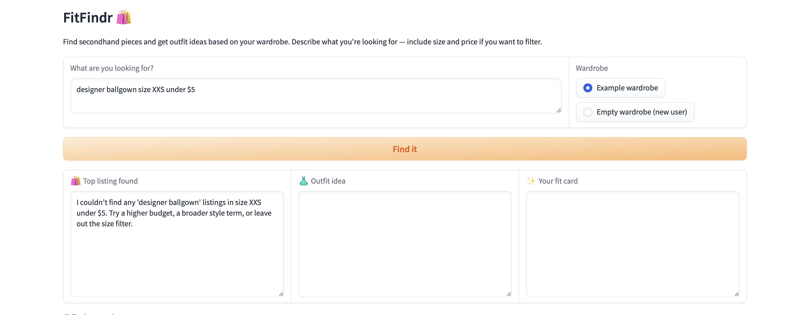

# FitFindr

FitFindr is an AI-powered thrift shopping assistant. You describe what you're looking for, it finds the best match from a secondhand listings dataset, suggests a complete outfit using your wardrobe, and generates a shareable fit card caption — all through a Gradio web interface.

---

## Setup

**Requirements:** Python 3.9+, a free [Groq API key](https://console.groq.com)

```bash
# 1. Create and activate a virtual environment
python -m venv .venv
source .venv/bin/activate       # Windows: .venv\Scripts\activate

# 2. Install dependencies
pip install -r requirements.txt

# 3. Add your Groq API key
echo "GROQ_API_KEY=your_key_here" > .env

# 4. Run the app
python app.py
```

Open the URL shown in your terminal (usually `http://127.0.0.1:7860`).

---

## Tool Inventory

### `search_listings`

**Purpose:** Searches the mock secondhand dataset for items matching the user's description, optional size, and optional price ceiling. No LLM call — pure keyword scoring and filtering.

**Inputs:**

| Parameter | Type | Required | Description |
|-----------|------|----------|-------------|
| `description` | `str` | Yes | Free-text query (e.g., `"vintage graphic tee"`). Matched case-insensitively against each listing's `title`, `description`, and `style_tags`. |
| `size` | `str \| None` | No | Size string to filter by (e.g., `"M"`, `"W30"`). Case-insensitive substring match against the listing's `size` field. `None` skips size filtering. |
| `max_price` | `float \| None` | No | Upper price bound, inclusive. `None` skips price filtering. |

**Output:** `list[dict]` — listings ordered by relevance score (keyword hit count, descending). Each dict has: `id`, `title`, `description`, `category`, `style_tags`, `size`, `condition`, `price`, `colors`, `brand`, `platform`. Returns `[]` if nothing matches — never raises an exception.

---

### `suggest_outfit`

**Purpose:** Given the thrifted item and the user's wardrobe, uses the Groq LLM (llama-3.3-70b-versatile) to suggest 1–2 complete outfit combinations. Falls back to general styling advice when the wardrobe is empty.

**Inputs:**

| Parameter | Type | Required | Description |
|-----------|------|----------|-------------|
| `new_item` | `dict` | Yes | A listing dict from `search_listings`. Reads `title`, `category`, `colors`, `style_tags`, and `condition`. |
| `wardrobe` | `dict` | Yes | Wardrobe dict with an `"items"` key containing a list of wardrobe item dicts. Pass `get_empty_wardrobe()` for a new user — the tool handles the empty case gracefully. |

**Output:** `str` — a non-empty outfit suggestion. If the wardrobe is empty, general styling advice is returned instead (e.g., what basics pair well with the item, what vibe it suits). Never returns an empty string or raises an exception.

---

### `create_fit_card`

**Purpose:** Turns the outfit suggestion into a casual, shareable OOTD caption (Instagram/TikTok style). Uses the Groq LLM at `temperature=1.0` so captions sound different each time.

**Inputs:**

| Parameter | Type | Required | Description |
|-----------|------|----------|-------------|
| `outfit` | `str` | Yes | The outfit suggestion string from `suggest_outfit`. If empty or whitespace-only, the function returns an error string without calling the LLM. |
| `new_item` | `dict` | Yes | The listing dict for the thrifted find. Reads `title`, `price`, `platform`, `colors`, and `condition`. |

**Output:** `str` — a 2–4 sentence caption mentioning the item name, price, and platform naturally. If `outfit` is empty, returns the string `"Error: no outfit suggestion provided — run suggest_outfit first before calling create_fit_card."` — no exception raised.

---

## Planning Loop

The agent runs a **linear pipeline** with an explicit early-exit check after each step. No dynamic tool selection — the order is always the same, but the loop can stop at any stage:

```
Parse query
    ↓
search_listings(description, size, max_price)
    ↓ results == [] → set error, STOP
    ↓ results non-empty
suggest_outfit(selected_item, wardrobe)
    ↓ (always continues — handles empty wardrobe gracefully)
create_fit_card(outfit, selected_item)
    ↓
Return completed session
```

**Step 1 — Parse:** `_parse_query()` uses regex to extract `description`, `size`, and `max_price` from the natural language query. No LLM call needed for this step.

**Step 2 — Search:** `search_listings()` filters the 40-item dataset and scores matches by keyword overlap. If zero listings pass the filters, the agent writes a human-readable error into `session["error"]` naming the specific filters that were too tight, then returns early.

**Step 3 — Suggest outfit:** `suggest_outfit()` calls the Groq LLM with a prompt that either includes wardrobe items (example wardrobe path) or asks for general styling advice (empty wardrobe path). This step always produces a usable string.

**Step 4 — Create fit card:** `create_fit_card()` calls the Groq LLM to write the OOTD caption. If the outfit string is empty (which shouldn't happen in normal flow), it returns a descriptive error string instead.

**Step 5 — Return:** The session dict is returned to `handle_query()` in `app.py`, which maps the results to the three Gradio output panels.

---

## State Management

All state lives in a single `session` dict initialized fresh at the start of every `run_agent()` call. Tools are stateless — they receive explicit arguments and return values; they never read from or write to the session dict directly. The planning loop reads from session and writes to it between tool calls.

| Key | Type | Written after | Used by |
|-----|------|--------------|---------|
| `session["query"]` | `str` | init | reference only |
| `session["parsed"]` | `dict` (`description`, `size`, `max_price`) | Step 1 parse | Step 2 to build tool arguments |
| `session["wardrobe"]` | `dict` | init (from caller) | Step 3 passed to `suggest_outfit` |
| `session["search_results"]` | `list[dict]` | Step 2 | stored for reference |
| `session["selected_item"]` | `dict` | Step 2 (`results[0]`) | Steps 3 and 4 |
| `session["outfit_suggestion"]` | `str` | Step 3 | Step 4 passed to `create_fit_card` |
| `session["fit_card"]` | `str` | Step 4 | Step 5 — returned to Gradio |
| `session["error"]` | `str \| None` | Any early-exit step | `handle_query()` — surfaces to UI if set |

Because the session is re-initialized each call (`_new_session()`), state never bleeds between separate user queries.

---

## Error Handling

### `search_listings` — no results

**Failure mode:** No listings pass the combined filters (size + price too restrictive, or description keywords don't match anything in the dataset).

**Agent response:** Sets `session["error"]` to a message naming the specific query, size, and price that produced zero results, then tells the user exactly what to try differently. Does **not** call `suggest_outfit` or `create_fit_card`.

**Concrete example from testing:**
```bash
python -c "from tools import search_listings; print(search_listings('designer ballgown', size='XXS', max_price=5))"
# → []
```
Full agent run:
```
error: I couldn't find any 'designer ballgown' listings in size XXS under $5.
       Try a higher budget, a broader style term, or leave out the size filter.
selected_item:       None
outfit_suggestion:   None
fit_card:            None
```
The UI surfaces this in the first panel; the other two panels stay blank.



---

### `suggest_outfit` — empty wardrobe

**Failure mode:** `wardrobe["items"]` is an empty list (new user with no saved pieces).

**Agent response:** Instead of stopping, `suggest_outfit` detects the empty list and switches to a "general advice" prompt. The LLM returns styling suggestions based on common wardrobe basics rather than specific owned items. The pipeline continues normally to `create_fit_card`.

**Concrete example from testing:**
```bash
python -c "
from tools import search_listings, suggest_outfit
from utils.data_loader import get_empty_wardrobe
results = search_listings('vintage graphic tee', size=None, max_price=50)
print(suggest_outfit(results[0], get_empty_wardrobe()))
"
# → "I'm obsessed with this Y2K Baby Tee, it's so cute and playful. This top would
#    pair perfectly with high-waisted jeans or a flowy skirt for a relaxed,
#    cottagecore vibe..."
```
Returns general advice — no exception, no empty string.

---

### `create_fit_card` — empty outfit string

**Failure mode:** `outfit` argument is an empty string or whitespace-only (defensive guard against upstream failure).

**Agent response:** Returns a descriptive error string immediately, without calling the LLM.

**Concrete example from testing:**
```bash
python -c "
from tools import search_listings, create_fit_card
results = search_listings('vintage graphic tee', size=None, max_price=50)
print(create_fit_card('', results[0]))
"
# → "Error: no outfit suggestion provided — run suggest_outfit first before calling create_fit_card."
```
Returns a string — no `ValueError`, no crash.

---

## Spec Reflection

**What changed from `planning.md` during implementation:**

The original spec described `suggest_outfit` as a rule-based scoring function that returns a structured dict `{"outfit": list[dict], "styling_note": str}` by comparing `style_tags` overlap between the new item and wardrobe pieces. During implementation this was replaced with a direct LLM call that returns a plain string, for two reasons: (1) the scoring logic would have needed significant tuning to produce useful results on a 10-item example wardrobe, and (2) an LLM generates richer, more natural outfit suggestions that actually name pieces and explain why the combination works.

This cascaded into `create_fit_card`: the original spec had it accept `outfit: list[dict]` and format it deterministically, but since `suggest_outfit` now returns a string, `create_fit_card` takes that string as its `outfit` parameter and passes it to the LLM for caption generation.

The empty-wardrobe handling also changed. The spec called for the agent to stop and return an error if the wardrobe was empty. The implemented behavior is more graceful — the tool detects the empty case and switches to a different LLM prompt instead of stopping the pipeline, which is a better user experience for new users.

The error message format simplified: the spec called for messages that interpolated the item's title and price into the wardrobe-empty error, but the actual error path uses a simpler template scoped to what information is available at each exit point.

---

## AI Usage

### Instance 1 — Generating `search_listings` from the spec

**What I gave the AI:** The full Tool 1 block from `planning.md` — the description, all three parameters with their types and matching semantics (case-insensitive substring for size, inclusive ceiling for price, keyword score across `title`/`description`/`style_tags`), the exact return-value field list, and the empty-list failure behavior. I also included the `load_listings()` function signature from `utils/data_loader.py`.

**What it produced:** A correct, working implementation that matched the spec almost exactly — keyword tokenization with a minimum length filter (`len(kw) > 1`), score computation, and sorted results. The implementation was clean and direct.

**What I changed before using it:** The AI initially used `any(kw in searchable for kw in keywords)` to include a listing (boolean, not scored), and sorted only listings that matched at least one keyword. I overrode this to use `sum(1 for kw in keywords if kw in searchable)` so results are ranked by how many keywords they match, giving more relevant items priority at the top of the list. I also removed a `try/except` block around `load_listings()` that would have silently swallowed file-not-found errors — if the data file is missing, I want that to surface as an exception, not return an empty list.

---

### Instance 2 — Generating the planning loop in `agent.py`

**What I gave the AI:** The Planning Loop section and State Management table from `planning.md`, plus the Architecture diagram showing the three tools as boxes with early-exit branches. I asked it to implement `run_agent(query, wardrobe)` returning a session dict, using the three tool functions I had already written and tested.

**What it produced:** A well-structured loop with `_new_session()`, `_parse_query()`, and `run_agent()` — closely matching my spec. The parse function used regex for price and size extraction as I'd planned, and the early-exit check after `search_listings` was correct.

**What I changed before using it:** The AI generated the empty-wardrobe check as a hard stop (matching the spec), but I'd already decided during tool implementation to make `suggest_outfit` handle the empty case gracefully instead. So I removed the `if not outfit:` early-exit block from the planning loop entirely — the tool now owns that logic. I also removed the AI-generated `try/except Exception` wrapper around each tool call that would have caught all exceptions and returned a generic error message; I prefer letting real exceptions surface so bugs are visible during development.
